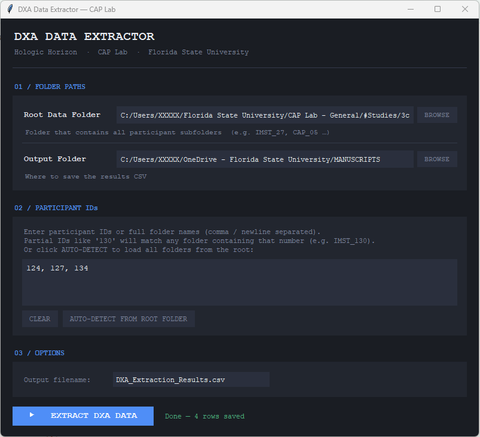

# DXA Data Extractor

A desktop GUI tool for batch-extracting body composition and bone density data from **Hologic DXA** PDF summary reports into a single CSV file. Built for longitudinal research studies with pre/post or multi-timepoint scan designs.

Developed at the **Cardiovascular and Applied Physiology (CAP) Lab**, Florida State University.

---

## Features

- **Point-and-click GUI** — no command-line usage required
- **Batch processing** — extract dozens of participants in one click
- **Partial ID matching** — type `130, 131, 134` and it finds `IMST_130`, `IMST_131`, etc. automatically
- **Auto-detects timepoints** — walks each participant folder and finds every subfolder with "DXA" in its name (e.g. `W0/DXA`, `W8/DXA`, `Pre/DXA`, `Post/DXA`). Each timepoint becomes its own row in the output
- **Auto-detects report type** — handles all four Hologic summary report variants (body composition + VAT, full comp with BMC, BMD/bone density, lean/fat summary) from the same run
- **Fixes Hologic font encoding bug** — some Hologic PDFs produce doubled characters (`RReeggiioonn`, `11229977..11`). The tool detects and corrects this automatically before parsing
- **~96 fields extracted per timepoint** including regional fat/lean mass, BMC, BMD, T/Z-scores, Android/Gynoid regions, VAT mass/volume/area, and adipose indices


---

## Extracted Fields

| Category | Fields |
|---|---|
| **Metadata** | Participant ID, Timepoint, Scan Date, Scan ID, Sex, Age, Height, Weight |
| **Regional Body Comp** | Fat Mass, Lean+BMC, Total Mass, % Fat for: L/R Arm, Trunk, L/R Leg, Subtotal, Head, Total |
| **Full Body Comp** (DXA4) | + BMC (g) and Lean Mass (g) per region |
| **Android / Gynoid** | Fat Mass, Lean+BMC, Total Mass, % Fat |
| **VAT** | Est. VAT Mass (g), Volume (cm³), Area (cm²) |
| **Adipose Indices** | Android/Gynoid Ratio, % Fat Trunk/Legs Ratio, Trunk/Limb Fat Ratio |
| **Lean Indices** | Lean/Height² (kg/m²), Appendicular Lean/Height² (kg/m²) |
| **BMD** | Area (cm²), BMC (g), BMD (g/cm²) per region + Total T-score and Z-score |

---

## Requirements

- Python 3.9 or higher
- `tkinter` (included with standard Python on Windows and macOS; see [Linux note](#linux) below)

Install dependencies:

```bash
pip install -r requirements.txt
```

---

## Installation

```bash
git clone https://github.com/Jonathan-Hoch/dxa-extractor.git
cd dxa-extractor
pip install -r requirements.txt
python dxa_extractor_gui.py
```

---

## Usage

1. **Root Data Folder** — select the folder that contains all your participant subfolders (e.g. the folder where `IMST_27`, `IMST_130`, etc. live)
2. **Output Folder** — select where the results CSV should be saved
3. **Participant IDs** — type the IDs you want to process, comma or newline separated:
   - Partial IDs work: `130, 131, 134` will match `IMST_130`, `IMST_131`, `IMST_134`
   - Full folder names also work: `IMST_130, IMST_131`
   - Or click **AUTO-DETECT FROM ROOT FOLDER** to populate all participant folders automatically
4. Click **▶ EXTRACT DXA DATA**

The log panel shows exactly which folders were found, which PDF report types were detected, and flags anything that couldn't be parsed.

---

## Expected Folder Structure

The tool is flexible — it walks the entire participant folder recursively and picks up any subfolder with `dxa` (case-insensitive) in its name. For example:

```
Root Data Folder/
├── IMST_130/
│   ├── W0/
│   │   └── DXA/
│   │       ├── DXA1.pdf
│   │       ├── DXA2.pdf
│   │       ├── DXA3.pdf
│   │       └── DXA4.pdf
│   └── W8/
│       └── DXA/
│           ├── DXA1.pdf
│           └── DXA2.pdf
├── IMST_131/
│   └── Pre/
│       └── DXA/
│           └── DXA1.pdf
```

Output CSV row labels would be:
- `IMST_130` · `W0_DXA`
- `IMST_130` · `W8_DXA`
- `IMST_131` · `Pre_DXA`

PDF filenames inside the DXA folder can be anything — the tool detects report type from content, not filename.

---

## Output

A single `.csv` file with one row per participant × timepoint. Key identifier columns (`Participant_ID`, `Timepoint`, `Scan_Date`, `Sex`, `Age`, `Height_in`, `Weight_lb`) appear first, followed by all extracted measurement columns.

---

## Compatibility

Tested on Hologic Horizon W DXA system, software version 13.6.x. The four report variants handled are:

| Report | Content |
|---|---|
| Body Composition + VAT | Regional fat/lean, Android/Gynoid, VAT, adipose/lean indices |
| Full Body Comp with BMC | Regional fat, lean, BMC, Lean+BMC, Total |
| BMD / Bone Density | Regional area, BMC, BMD, Total T-score and Z-score |
| Lean/Fat Summary | Regional fat, Lean+BMC, % Fat |

---

## Linux

`tkinter` is not always included in Python on Linux. Install it with:

```bash
# Ubuntu / Debian
sudo apt install python3-tk

# Fedora
sudo dnf install python3-tkinter
```

---

## License

MIT License. See `LICENSE` for details.

---

## Citation

If you use this tool in published research, please cite the CAP Lab, Florida State University, and link to this repository.
